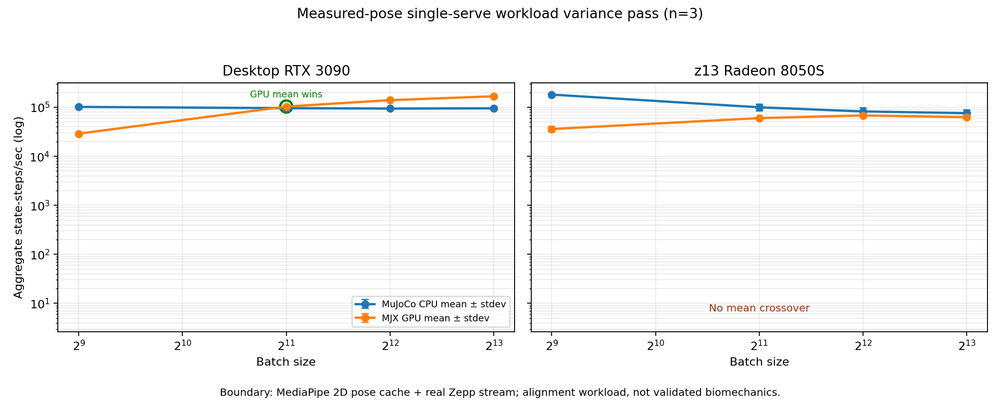

# CPU/GPU Simulation Has a Workload Crossover

**Status:** published
**Date:** 2026-08-25
**Project:** Bulkhead τ / Bulkhead Tau
**Paper group:** Sensor-to-Simulation Engineering
**Publication posture:** frozen and published. The benchmark evidence includes
cached MediaPipe landmarks from the single-serve video and a three-repeat
variance pass on both desktop and z13.

## Abstract

GPU simulation is not automatically faster than CPU simulation. The useful
engineering rule is workload-shaped: use CPU for small or latency-sensitive
simulation batches, and use GPU only after the target scene has enough
independent work to amortize accelerator overhead.

This paper reports three progressively more realistic MuJoCo/MJX measurements.
A tiny sensor-state kernel built from real TennisAgent IMU windows does not
cross over on either a dual-RTX-3090 desktop or a Ryzen AI MAX 390 / Radeon
8050S laptop. A larger articulated generic scene reaches practical desktop
crossover near batch 512 and approaches parity on the laptop by batch 4,096. A
single-serve articulated TennisAgent workload, built from one real serve video
template and one real Zepp origins stream, reaches desktop crossover between
batch 512 and 2,048 while still not crossing over on the laptop by batch 8,192.

The result is not "GPU good" or "CPU good." It is a routing rule:

> CPU is the default for small simulations. GPU becomes useful when the workload
> is both sufficiently articulated and sufficiently batched for the specific
> hardware path.

## 1. Question

When does CPU MuJoCo stop being the better substrate, and when does batched MJX
GPU execution become worthwhile?

The question matters for Bulkhead τ because sensor and hardware-in-the-loop
workloads are not homogeneous. Some paths are firmware-fidelity controls, some
are tiny sensor transforms, and some are large hypothesis sweeps over simulated
states. Treating all of them as "GPU work" would overstate the accelerator's
role. Treating all of them as "CPU work" would miss the point where large
parallel sweeps become cheaper on the GPU.

## 2. Hardware and Backends

| Machine | CPU/GPU path | Notes |
|---|---|---|
| Desktop | native MuJoCo CPU; MJX on CUDA `cuda:0` / `cuda:1` | dual RTX 3090 available; rows are separate device measurements, not a combined two-GPU speedup |
| z13 | native MuJoCo CPU; MJX on ROCm `rocm:0` | Ryzen AI MAX 390 / Radeon 8050S unified-memory path via side-by-side ROCm 7.2.4 userspace |

All runners report native CPU rows and MJX rows at matched batch sizes. JIT
warm-up is excluded from steady-state timing. GPU rows are only treated as GPU
evidence when JAX reports an actual CUDA or ROCm device.

## 3. Evidence Packets

Primary evidence lives under:

`docs/domain_runs/MUJOCO-CPU-MJX-SCALE-001/`

Key artifacts:

- `desktop_3090_large_verified.json` — large articulated generic scene on desktop CUDA.
- `z13_rocm7_large_2026-08-24.json` and `z13_rocm7_large4096_2026-08-24.json` — matching large-scene z13 ROCm evidence.
- `tennis_sensor_adapter.json` and `z13_tennis_sensor_adapter.json` — real TennisAgent sensor-state adapter.
- `single_serve_skeleton_sensor_desktop.json` and `single_serve_skeleton_sensor_z13.json` — single-serve articulated workload.
- `single_serve_skeleton_sensor_crossover_plot.png` — summary plot.

The summary plot is here:

`docs/domain_runs/MUJOCO-CPU-MJX-SCALE-001/single_serve_posefit_variance_plot.png`

## 4. Result 1 — Large Generic Articulated Scene

The large generic scene is a 10-joint articulated MuJoCo model. It is not a
TennisAgent domain model, but it establishes the basic scaling behavior: scene
complexity and batch size determine whether GPU launch and synchronization
overhead are amortized.

### Desktop RTX 3090

| Batch | Native CPU | RTX 3090 GPU 0 | RTX 3090 GPU 1 | Reading |
|---:|---:|---:|---:|---|
| 256 | 166,121 | 110,417 | 107,786 | CPU leads |
| 512 | 166,458 | 169,128 | 166,988 | practical parity |
| 1,024 | 160,500 | 253,316 | 257,943 | GPU leads |
| 2,048 | 151,117 | 293,124 | 304,164 | GPU leads |
| 4,096 | 150,989 | 334,735 | 330,209 | GPU leads ~2.2x |

Evidence: `desktop_3090_large_verified.json`.

### z13 unified Radeon path

On the z13, the same large scene approached crossover but did not beat CPU in
the tested range. At batch 4,096, CPU measured 164,665 steps/s and the Radeon
measured 161,247 steps/s: only a 1.02x CPU advantage.

Evidence: `z13_rocm7_large4096_2026-08-24.json`.

## 5. Result 2 — Real TennisAgent Sensor-State Kernel

The first TennisAgent adapter intentionally stayed conservative. It used real
Zepp and Apple Watch IMU windows, kept the sensor lanes separate, and reported
LabWired only as a firmware-fidelity control. Each real IMU sample initialized a
free-body state with:

`qvel = [accel * dt linear-velocity proxy, measured gyro]`

This representation is honest, but too small to make the GPU useful.

### Desktop result

At batch 256, native CPU remained far ahead:

| Lane | CPU | Best MJX GPU | Reading |
|---|---:|---:|---|
| Zepp | ~561k | ~40k | CPU wins |
| Apple Watch | ~562k | ~44k | CPU wins |

Evidence: `tennis_sensor_adapter.json`.

### z13 result

At batch 256, CPU also led on z13; Apple Watch batch 512 narrowed but did not
cross:

| Lane / batch | CPU | MJX GPU | Reading |
|---|---:|---:|---|
| Zepp / 256 | ~711k | ~199k | CPU wins |
| Apple Watch / 256 | ~710k | ~216k | CPU wins |
| Apple Watch / 512 | ~704k | ~309k | CPU wins |

Evidence: `z13_tennis_sensor_adapter.json`.

## 6. Result 3 — Single-Serve Articulated Skeleton/Sensor Workload

The heavier TennisAgent workload is closer to an actual application. It uses the
existing real serve video:

`domains/SensorAgents/TennisAgent/data/golden_sessions/serves_20260103/IMG_0050.MOV`

and the real Zepp origins stream for swing `1767490069922` from the plugged-in
phone pull / local Zepp database. The model is a 10-actuator torso/arm/racket
chain. The batch dimension is not fake duplicated swings; it is a deterministic
calibration sweep over one serve:

- time offset;
- pose scale;
- sensor gain;
- pronation bias.

The template now uses cached MediaPipe pose landmarks from the actual serve
window. The conversion is intentionally simple: 2D shoulder/elbow/wrist angles
become arm/racket joint targets. This closes the measured-skeleton-fit gate, but
it remains a 2D pose-derived alignment workload rather than validated 3D
biomechanics.

### Desktop RTX 3090 result

The desktop crossed over between batch 512 and 2,048.

| Batch | CPU | Best CUDA MJX | GPU / CPU |
|---:|---:|---:|---:|
| 512 | ~100k | ~28k | 0.28x |
| 2,048 | ~97k | ~112k | 1.16x |
| 4,096 | ~95k | ~145k | 1.52x |
| 8,192 | ~96k | ~171k | 1.79x |

Evidence: `single_serve_skeleton_sensor_desktop.json`.

A three-repeat variance pass on the measured-pose workload preserved the same
routing decision. Mean throughput over repeats:

| Batch | CPU mean | Best CUDA mean | GPU / CPU mean |
|---:|---:|---:|---:|
| 512 | ~102k | ~29k | 0.29x |
| 2,048 | ~96k | ~104k | 1.08x |
| 4,096 | ~94k | ~140k | 1.49x |
| 8,192 | ~95k | ~168k | 1.76x |

Evidence: `single_serve_posefit_variance_desktop_summary.json` and repeat files
`single_serve_posefit_variance_desktop_r1.json` through `r3.json`.

### z13 ROCm result

The z13 did not cross over in the tested range.

| Batch | CPU | ROCm MJX | GPU / CPU |
|---:|---:|---:|---:|
| 512 | ~164k | ~38k | 0.23x |
| 2,048 | ~105k | ~63k | 0.59x |
| 4,096 | ~96k | ~69k | 0.72x |
| 8,192 | ~74k | ~62k | 0.83x |

Evidence: `single_serve_skeleton_sensor_z13.json`.

The z13 three-repeat variance pass also preserved the routing decision. Mean
throughput over repeats:

| Batch | CPU mean | ROCm MJX mean | GPU / CPU mean |
|---:|---:|---:|---:|
| 512 | ~182k | ~36k | 0.20x |
| 2,048 | ~100k | ~60k | 0.61x |
| 4,096 | ~82k | ~68k | 0.84x |
| 8,192 | ~76k | ~63k | 0.84x |

Evidence: `single_serve_posefit_variance_z13_summary.json` and repeat files
`single_serve_posefit_variance_z13_r1.json` through `r3.json`.

This does not mean the z13 GPU path is broken. It means the laptop CPU is strong
and the integrated GPU/ROCm path does not beat it for this workload by batch
8,192. The desktop result is different because the RTX 3090 has enough raw
parallel throughput to pass its CPU once the articulated workload is large
enough.

## 7. Interpretation

The three measurements form a useful ladder:

| Workload | Desktop result | z13 result | Meaning |
|---|---|---|---|
| Tiny real sensor-state kernel | no crossover by batch 256 | no crossover by batch 512 | CPU default for small sensor transforms |
| Large generic articulated scene | crossover near batch 512 | near parity at batch 4,096 | articulation and batching matter |
| Single-serve measured-pose articulated alignment sweep | crossover between batch 512 and 2,048 | no crossover by batch 8,192 | application-shaped workload crosses on discrete GPU, not unified iGPU |

The CPU comparison is also informative. In the single-serve workload the z13 CPU
is not weak; it is faster than the desktop CPU at most batch sizes. The desktop
crossover is therefore not explained by a weak CPU baseline. It is explained by
the RTX 3090 GPU path becoming worthwhile once the batch is large enough.

## 8. Boundaries

This paper does not claim:

- a universal batch-512 or batch-2,048 threshold;
- a combined two-GPU speedup from the dual 3090s;
- validated 3D biomechanics;
- authoritative racket speed, ball impact, spin, or pronation measurement from the MuJoCo model;
- that LabWired replay is a GPU benchmark;
- that z13 ROCm is broken because it did not cross over.

The claim binds to the named runners, artifacts, machines, batch sizes, and
workload representations. The TennisAgent single-serve workload is a bridge from
synthetic scaling to application-shaped scaling, not a finished digital twin.

## 9. Engineering Rule

Use this routing rule in Bulkhead τ:

1. Run small or latency-sensitive sensor transforms on CPU.
2. Keep LabWired on its firmware-fidelity path; do not relabel it as GPU work.
3. Use GPU for large parallel articulated sweeps only after a measured crossover
   exists for the target scene and hardware.
4. Treat desktop RTX 3090 and z13 unified Radeon as different routing targets;
   a crossover on one does not imply crossover on the other.

## 10. Publication State

The two active-draft gates are closed:

- measured pose: cached MediaPipe landmarks extracted from the actual serve window;
- variance: three-repeat measured-pose runs completed on both desktop and z13,
  with GPU telemetry logs captured.

Optional future extensions remain:

- add a second serve video/template to show that the routing result is not one
  clip's artifact;
- add an application-faithful ProximityAgent geometry/ray workload;
- add a public-facing demo page that embeds the plot and boundary text.

Those extensions would widen the claim. They are not required for the bounded
routing rule published here.
